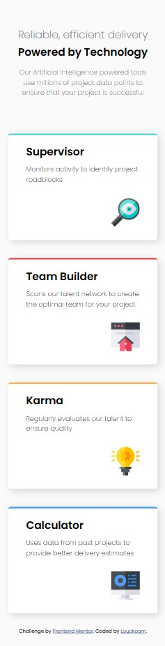
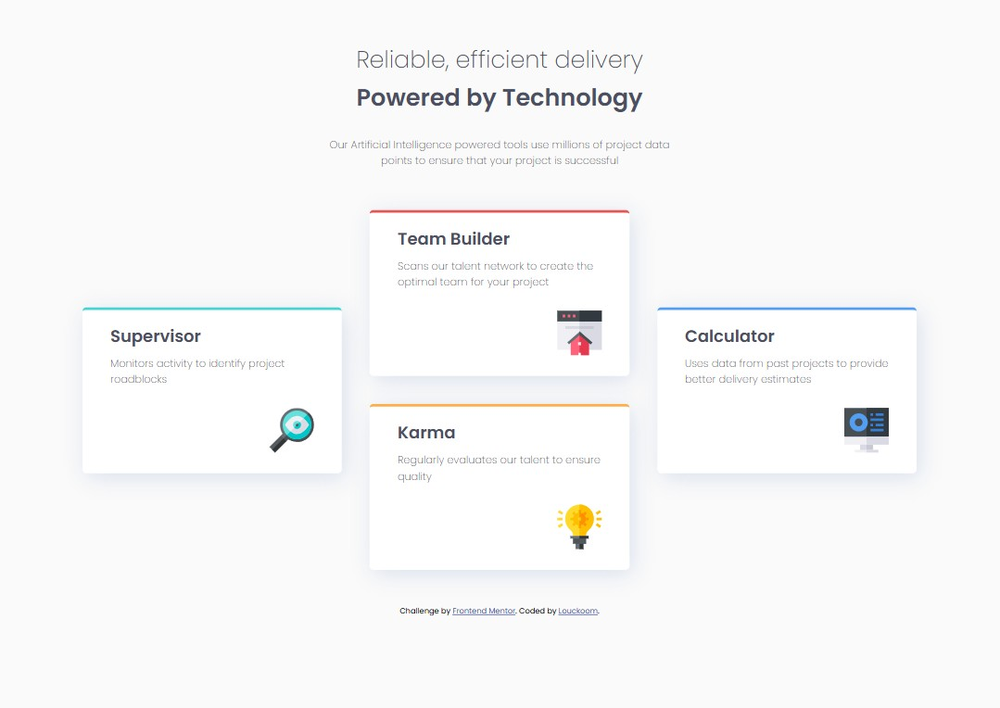

# Frontend Mentor - Four card feature section solution

This is a solution to the [Four card feature section challenge on Frontend Mentor](https://www.frontendmentor.io/challenges/four-card-feature-section-weK1eFYK). Frontend Mentor challenges help you improve your coding skills by building realistic projects. 

## Table of contents

- [Overview](#overview)
  - [The challenge](#the-challenge)
  - [Solutions Screenshot](#solutions-screenshot)
  - [Links](#links)
- [My process](#my-process)
  - [Built with](#built-with)
  - [What I learned](#what-i-learned)
  - [Continued development](#continued-development)
  - [Useful resources](#useful-resources)
- [Author](#author)
- [Acknowledgments](#acknowledgments)

## Overview

### The challenge

The challenge is to build out this feature section and get it looking as close to the design as possible.

** Mobile **

** Desktop **

### Solutions Screenshot

** Mobile **

** Desktop **

### Links

- Solution URL: [https://github.com/Louckoom/four_card_section]
- Live Site URL: [Add live site URL here](https://your-live-site-url.com)

## My process

### Built with

- Semantic HTML5 markup
- CSS custom properties
- Flexbox
- CSS Grid
- Mobile-first workflow
- SCSS

### What I learned

- Use CSS grid to create a custom grid layout.
- Combining CSS grid with flexbox.

### Continued development

Maybe some intermediate media query to make the responsive more elegant.

### Useful resources

- [CSS Grid generator](https://cssgrid-generator.netlify.app/) - This helped me to create a custom grid layout.

## Author

- Frontend Mentor - [@Louckoom](https://www.frontendmentor.io/profile/Louckoom)
- Twitch - [@LuckyCiel](https://www.twitch.tv/luckyciel)

## Acknowledgments

Did all by myself.
